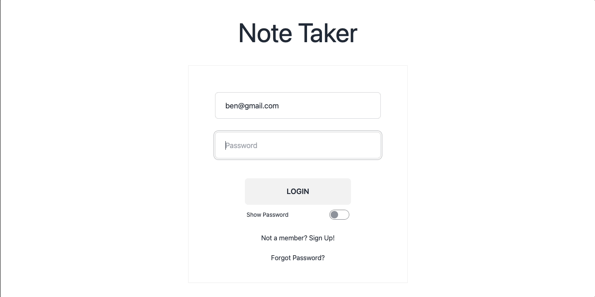

# Note Taker

## Description
Note Taker is a simple application that allows the user to create, save, edit, and delete notes. The application uses Google Firebase and Firestore for user authentication and storage of data. It is deployed on Vercel and can be accessed [here](https://note-taker-2-icr6jae1l-adam-brannons-projects.vercel.app/).

## Quick Links

- [Installation](#installation)
  
- [Usage](#usage)

- [Technologies](#technologies)

- [Demo](#demo)
  
- [Contributors](#contributors)
  
- [Feedback and Support](#feedback-and-support)
  
- [License](#license)

## Installation

To install this application, please follow the below instructions:
- Clone the repository files to your local machine
- Open the repository in your code editor of choice
- Open the terminal and run the command `npm install` to install the required dependencies
- Once the dependencies are installed, run npm start to start the application

## Usage

- To use Note Taker:
    - Navigate to the deployed application [here](https://note-taker-2-icr6jae1l-adam-brannons-projects.vercel.app/)
    - Click the "Not a member? Sign Up" link under the sign-in form
    - Enter your name, email address, and password and click the "Register" button
    - You will be redirected to the note screen
    - Enter the title and content of your note in the appropriate fields
    - Click the "Save" button to save your note
    - Click the "Previous Entry" to the left of the text area that you would like to edit
    - Edit the title and content of your note in the appropriate fields and click the "Save" button to save your changes
        - If you would like to delete the note, click the "Delete" button and you will be redirected to the note screen
    - Click the "Logout" button to log out of the application
    - You will be redirected to the login screen

## Technologies

       

          

          
          

## Demo

## Contributors
Adam Brannon

[Github](https://github.com/adam-brannon09)

[Email Me](mailto:adam.brannon09@icloud.com)

## Feedback and Support

If you encounter any issues while using Note Taker or have any suggestions for improvement, please [open an issue](https://github.com/adam-brannon09/note_taker_2/issues) on the GitHub repository. I appreciate your feedback and will address any concerns as soon as possible.

## License

The Note Taker is released under the [MIT License](https://opensource.org/licenses/MIT). You are free to use, modify, and distribute this application as per the terms of this license.

    
     

